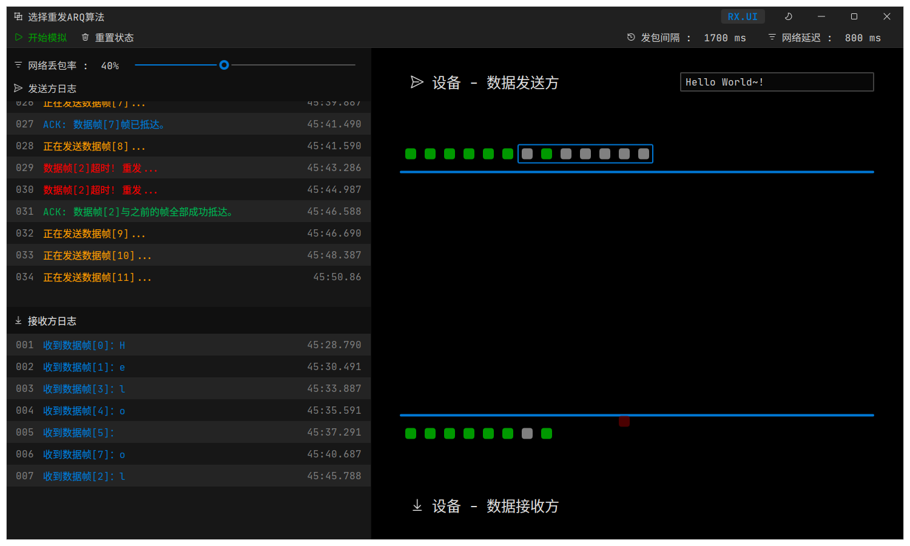

# 计算机网络 - 选择重发ARQ算法模拟

西电 网络与信息安全学院 计算机网络大作业

本项目基于QtQuick和C++构建。

> 高性能ですから!

## 构建方法

### Windows

安装Microsoft Visual Studio 2019 or 2022，选择安装C++开发相关组件，选择CMake构建工具；

安装Qt 5.15.2或更高版本；

clone本项目到本地，戳那个Build。

### Linux

以下环境均在Arch Linux下，理论上不同发行版通用。

```
sudo pacman -S qt5 cmake

git clone https://github.com/Reverier-Xu/CSNetworkEmulator

cd CSNetworkEmulator

mkdir build && build

cmake .. && make

bin/CSNetworkEmulator

```

其中，请确保你的发行版仓库中Qt version >= 5.15.2，cmake version >= 3.12。

## 截图



## License

Mozilla Public License v2.0

Author: 
- @Reverier-Xu
- @ll1ng
